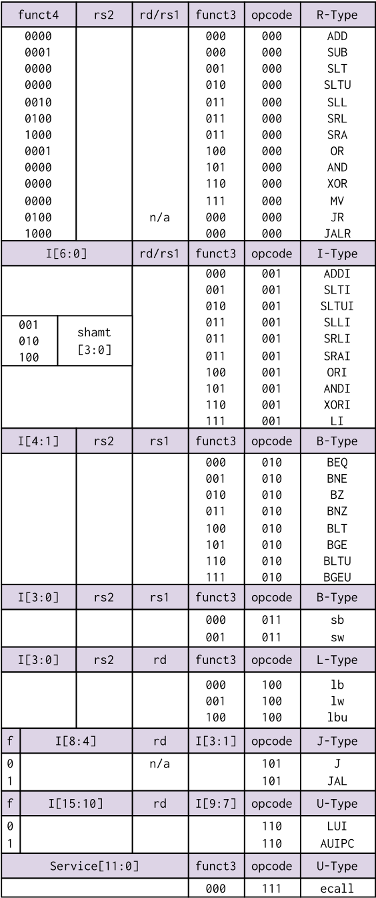

# Z16 Instruction Set Architecture (ISA) Specification

Z16 is a compact, 16-bit RISC-style instruction set architecture inspired by RISC-V RV32I, designed for small, efficient embedded systems. It supports 64 KB of byte-addressable memory and uses a fixed 16-bit instruction width. The ISA is optimized for simplicity and compact encoding, using a 2-register format for most operations.


## Key Features

- **Instruction Width:** 16 bits (fixed)
- **Registers:** 8 general-purpose registers (x0–x7), each 16 bits wide
- **Memory:** 64 KB (16-bit addressing), byte-addressable
- **Word Size:** 16 bits
- **Register Format:** For arithmetic/logical instructions, the first register (`rs1`) is both source and destination
- **All branches and jumps are PC-relative**, except for **JALR**
- **Immediate instructions** support up to 7-bit signed immediates
- `li` (load immediate) is a true instruction

## Register ABI

| Reg | ABI | Function                    |
|-----|-----|-----------------------------|
| x0  | t0  | Temporary register          |
| x1  | ra  | Return address              |
| x2  | sp  | Stack pointer               |
| x3  | s0  | Callee-saved register       |
| x4  | s1  | Callee-saved register       |
| x5  | t1  | Temporary register          |
| x6  | a0  | Function arg / return val   |
| x7  | a1  | Function arg / return val   |

## Comparing RV32I to Z16
||RV32I|Z16|
|-|-----|---|
|Architecture |32-bit RISC ISA| 16-bit RISC ISA|
|Memory|Byte addressable 4 Gbytes| Byte addressable 64 Kbytes|
Registers|32 x 32-bit registers| 8 x 16-bit registers|
|`x0`|`zero`| `t0`|
| `li`, `bz`, `bnz`, `jr` and `j`| pseudo instructions | true instructions|
|immediate |signed 12 bits|signed 7 bits|
|L/S Offset| signed 12 bits| signed 4 bits|


## Instructions Encoding


## Instruction Types

### 1. R-Type (Register-to-Register)
- **Opcode:** `000`
- **Format:** `funct4 | rs2 | rs1 | funct3 | opcode`
- **Operation:** `rs1 = rs1 op rs2`
- **Examples:** `ADD`, `SUB`, `SLL`, `SRL`, `AND`, `OR`, `XOR`, `SLT`, `SLTU`, `SRA`, `JR`, `JALR`, `MV`

### 2. I-Type (Immediate)
- **Opcode:** `001`
- **Format:** `imm[6:0] | rs1 | funct3 | opcode`
- **Operation:** `rs1 = rs1 op imm`
- **Examples:** `ADDI`, `SLTI`, `ORI`, `ANDI`, `SLLI`, `SRLI`, `SRAI`, `LI`

### 3. B-Type (Branch)
- **Opcode:** `010`
- **Format:** `imm[4:1] | rs2 | rs1 | funct3 | opcode`
- **Examples:** `BEQ`, `BNE`, `BZ`, `BNZ`, `BLT`, `BGE`, `BLTU`, `BGEU`  
- **Note:** `BZ` and `BNZ` only use `rs1`, compared to zero

### 4. S-Type (Store)
- **Opcode:** `011`
- **Format:** `imm[3:0] | rs2 | rs1 | funct3 | opcode`
- **Examples:** `SB`, `SW`

### 5. L-Type (Load)
- **Opcode:** `100`
- **Format:** `imm[3:0] | rs2 | rd | funct3 | opcode`
- **Examples:** `LB`, `LW`, `LBU`

### 6. J-Type (Jump)
- **Opcode:** `101`
- **Format:** `f | imm[9:4] | rd | imm[3:1] | opcode`
- **Examples:** `J`, `JAL`

### 7. U-Type (Upper Immediate)
- **Opcode:** `110`
- **Format:** `f | imm[15:10] | rd | imm[9:7] | opcode`
- **Examples:** `LUI`, `AUIPC`

### 8. SYS-Type (System)
- **Opcode:** `111`
- **Format:** `service[11:0] | funct3 | opcode`
- **Examples:** `ECALL`


## Special Semantics

- **All arithmetic/logical operations use 2-register format:**  
  `rs1 = rs1 op rs2`
- `LI` is a real instruction (not pseudo)
- `JR` and `JALR` jump to the address in a register (`rs2`)
- Jumps and branches are PC-relative
- Loads/stores use base+offset addressing


## Calling Convention Summary

- **Arguments:** `a0 (x6)`, `a1 (x7)`
- **Return value:** `a0 (x6)`
- **Return address:** `ra (x1)`
- **Stack pointer:** `sp (x2)`
- **Callee-saved:** `s0 (x3)`, `s1 (x4)`
- **Caller-saved:** `t0 (x0)`, `t1 (x5)`, `a0`, `a1`

## The Assembler
The repo contains a simple 2-pass assembler for Z16 ISA. The assembler is very similar to RISC-V ones. At the moment, the assembler supports only Z16 true instructions. The recommended assembly program skeleton is given below:
```GAS
# Add some comments to describe the program

# the TEXT Section
    .text
    .org    0
main:
    # Your code goes here
    # you can use the ABI register names
    # Also, you may end the line with a comment

    li      a0, 25      # A sample instruction

    # A sample label
    # A label cannot be followed by anything
L1:

   # terminate the program
exit:
    ecall   3

# The DATA Section
    .data
    # if you don't provide a starting location, the DATA Section
    # starts immediately after the TEXT Section.
    .org    0x100

    # Some data definitions
str:   
    .asciiz "hello world!"
A:
    .byte   50
B:
    .word   0x23A0, 500, 30000
C:
    .space  200
```

To invoke the assembler, use:

`./z16asm [-v] [-d] [-o <binary_file>] <sourcefile>`
- `-d` : Output debugging messages as it runs
- `-v` : Dump the symol table as well as the Section sizes.
- `-o` : Specify the binary file name (optional)

In addition to the binary file, the assembler outputs the list file (.lst) that combines the source and machine codes.

## Contribution
Please refer to the contribution guide [here](docs/contribute.md).